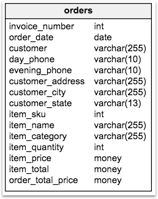
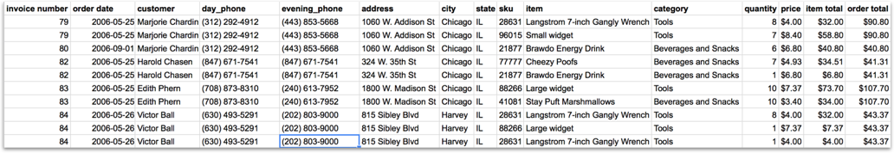
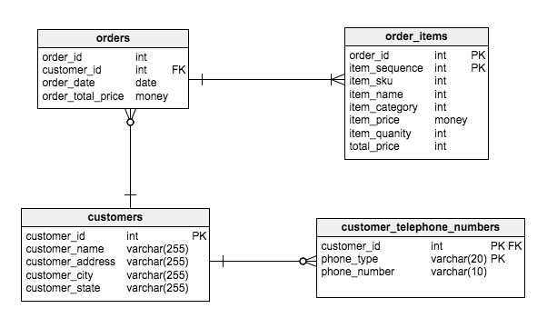

# A gentle introduction to databases and SQL


\- Thomas Yager-Madden  
<small>_Data Architect, OAO_</small>


---
## A couple of defintions
<!-- .slide: data-transition="none" -->
- An ***information system*** is any capital investment in a business process
- A ***database*** is the part of any information system that holds records describing _relevant_ details about transactions
Note: Any business process involves making contractual agreements and then executing them. These transactions involve entities and their attributes that constitute the universe of discourse around the BP itself.
---
## Databases
<!-- .slide: data-transition="none" -->

Usually refers to a **Relational** Database Management System (RDBMS)

---
## Databases
- Data stored in tables made of rows and columns  
  
---
## Database tables
- Each row in a table is an entity or instance of a model
- Each column contains attributes about that instance in each row
- A database on an RDBMS will usually have many tables
Note: Recent NoSQL databases are increasingly providing SQL-like APIs
---
## Tables
<!-- .slide: data-transition="none" -->

- Tabular representation reminds us of spreadsheets
- Structure of a table must be defined in advance (table schema)
- That structure limits what can go in a column
- Rows are unordered
- Definition includes other tables, and declares how they can be used together  
Note: point out repeating groups of information
---
## Linked tables

- Model looks more complex, but simplifies common operations
---
## So, SQL!
<!-- .slide: data-transition="none" -->
- **S**tructured **Q**uery **L**anguage
- A standard language for working with databases
- SQL is a **very high-level** programming language
- While there is a standard, most commercial and open source databases have distinct implementations
- OAO uses open source PostgreSQL databases for most applications, including the data warehouse
---
## SQL is a...
<!-- .slide: data-transition="none" -->
- Data Definion Language (DDL)
    - Define table schemas
    - Create/alter/delete tables and their attributes
- Data Manipulation Language (DML)
    - Insert/delete/modify(update) tuples in tables
    - View (select) data from one or more tables  
Note: remainder will focus on DML
---
## SQL query

The basic form of a SELECT query is like:

```
select <column list>
  from <one or more tables>
 where <filter conditions>
```
---
## Example

```
select order_id,
       order_date,
       order_total_price,
       customer_name
  from orders, customers
 where orders.customer_id = customers.customer_id
   and customer_name = 'Marjorie Chardin'
```
---
## Results
order_id |order_date | order_total_price| customer_name
--|--|--|--
79  |2006-05-25   |$90.80   |Marjorie Chardin  
80  |2006-09-01   |$40.80   |Marjorie Chardin  
---
## Demonstration
Over to you, Henry...
---
## Questions

