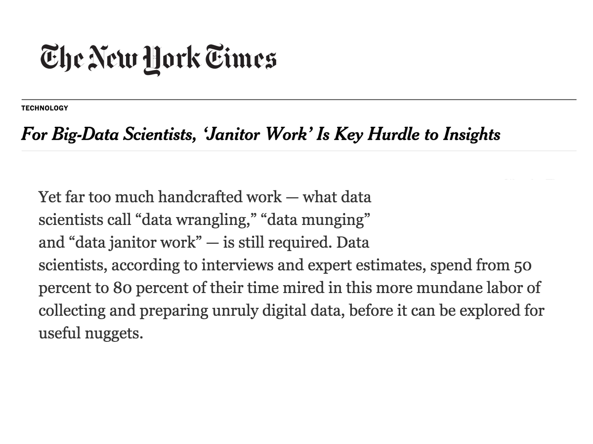
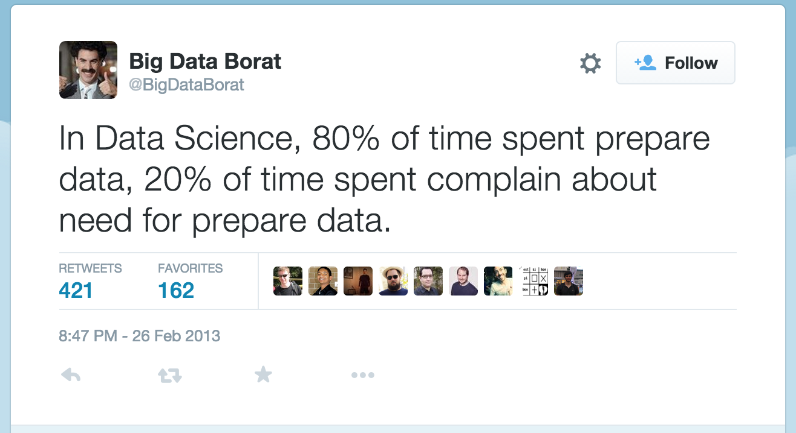
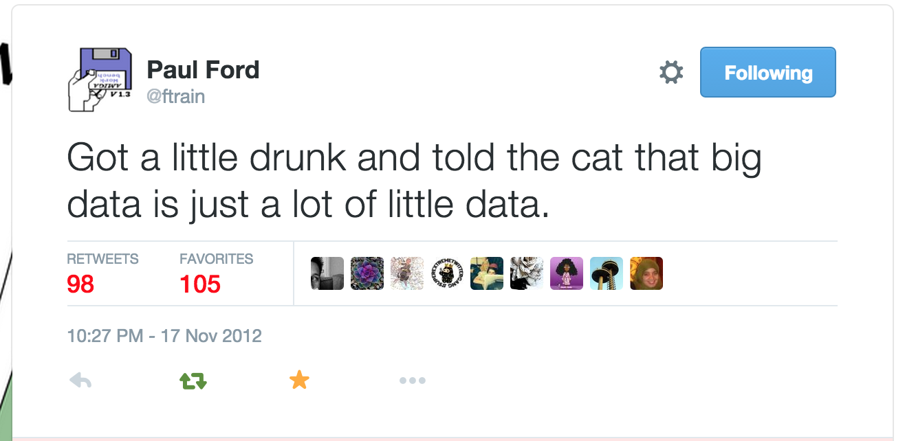
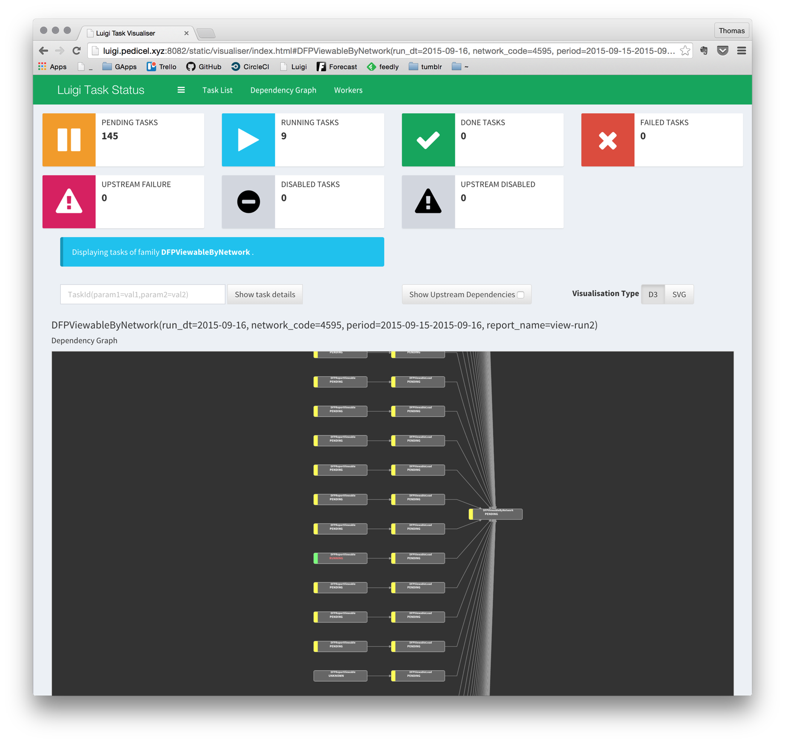
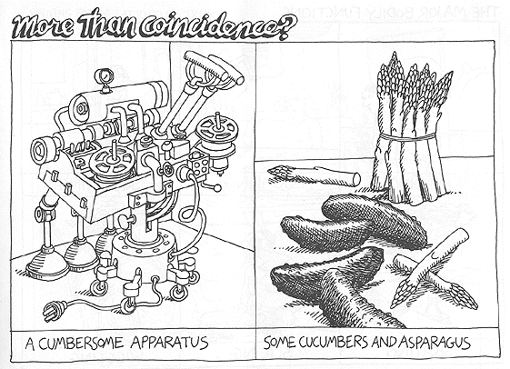

# Refactoring Luigi
### (With an intro to Luigi concepts and architecture)


\- Thomas Yager-Madden  
2015-09-12

---
## A brief introduction to Luigi

<!-- .slide: data-transition="none" -->
Note: This 80% thing is anecdotal, but it's rare that NYT and Borat agree
---
## A brief introduction to Luigi
<!-- .slide: data-transition="none" -->
  
Note: Erik Bernhardson said he hopes using Luigi brings that number down to 70%
---
## A brief introduction to Luigi
<!-- .slide: data-transition="none" -->

Note: I'm not doing this to sell anybody on Luigi.
I think in time we're going to have a lot of data processing jobs
We're not Spotify, and we might not have the 10,000+ jobs that they have,
but experience shows even a few dozen are hard to manage without organization.

When munging is a chore for analysts, The model for iterative development is a feedback loop where we find out what sorts of munging the analyst has to do a lot of, and provide a data mart where that has already happened, and automate the process of populating that. So, we only have a few simple jobs now, but I hope it's easy to see that getting larger and more complicated quickly.

Benefit of a tool is makes DRY easily, cuts down on boilerplate, hopefully has already solved problems you might not even expect. Get the benefit of someone else's experience in the problem space.

I tried using Talend, but it wasn't suited to DFP. If I knew enough Java to incorporate the Google API client libs into Talend, this could all be very different.

My model for doing ETL with code was Spring Batch, which they use at Trade Monster. Python doesn't (really) have anything precisely equivalent. I looked at a couple of ETL frameworks, but they didn't impress (although PETL looks good now) and particularly didn't seem to support (again) the custom things I knew we had to be able to do. Brett had recently linked to Luigi, and I took another look, and seemed able to create the kinds of abstractions I was after.

---
## A brief introduction to Luigi
<!-- .slide: data-transition="none" -->

- A workflow manager
- Doesn't handle coding the logic of tasks
- It helps with the **plumbing** of connecting lots of tasks into complicated pipelines
- Basic conceptual model: every workflow a graph of tasks
Note: This idea of a workflow engine is a pretty common pattern (oozie, azkaban, airflow, etc. Several of these are even in Python, so we have more of a choice than I might have realized. They tend to require instantiating the graph as a config or its own complex object)

---
<!-- .slide: data-transition="none" -->
## A brief introduction to Luigi
**Plumbing Issues**  
Think of a bunch of data processing jobs with interdependencies
- Errors will occur; need to clean up and resume the workflow
- Parameterization: for configuration and command line usage
- Repeatability: we want to be able to run the dataflow for a set of similar inputs
- Generalization is crucial for scale
---
<!-- .slide: data-transition="none" -->
## A brief introduction to Luigi
**Luigi features**  
- Very simple, code-based dependency definition (like Make)
- Ready-made Task classes and targets
    - Easy to make new ones — just implement `run()`
- Atomic file operations; idempotent tasks
- Task parameters like magical class variables
    - Automatically generates CLI with typing and documentation
- Workflow progress visualization
- Automated error reporting

Note: each task declares its dependencies in requires(), upstream tasks can have dependencies in turn (scheduler handles parsing all of this and rendering the graph)
The base Task class provides a kind of templating language as well as a set of templates for GCS, HDFS, Copy to Postgres, SQLA, etc.

Atomic idempotent operations, helps with resuming - every target is has a file-like API, every tasks succeeds or fails entirely. You don't end up with partial writes that are hard to clean up. Can run a job again and Luigi won't repeat the finished steps.

Parameters save a TON of argparse boilerplate. You just set a variable to a Parameter and get command-line parsing and help text for free. Also can be set in luigi.cfg. Total batteries-included thing.

Error reporting just requires email configuration. Sending on task crash is built-in; email notification an easy call if you want to notify on anything else.

New-model visualizer.

---
<!-- .slide: data-transition="none" -->
## A brief introduction to Luigi
**Luigi features**  


Note: just here to look at

---
## Refactoring to Task template classes
- This is pretty basic; similar tasks can be made into a superclass, with details provided via subclassing
- Examples:

[<i class="fa fa-github"></i> Earliest DFP Historical Report iteration](https://github.com/OAODEV/warehouse-etl/blob/68257dc231729aee8d7783e24e216fff6be06505/expand-rpt.py)

[<i class="fa fa-github"></i> Client connection and network lookup moved to library](https://github.com/OAODEV/warehouse-etl/tree/249a5f0d7588541255126c19b337969e3486b29e/tasks)

[<i class="fa fa-github"></i> So the actual invocation gets a lot simpler](https://github.com/OAODEV/warehouse-etl/blob/249a5f0d7588541255126c19b337969e3486b29e/dfp_future.py)

Note: By the first commit, I'd already seen a need to create parent classes for pulling from DFP and writing to Postgres. (Could have been more abstract). But the wrapper task at the end has a lot of boilerplate.

In the simpler example, note that ReportExtract also uses the api fuction

---
## Problem: Duplication of Parameters
A Luigi worker is, essentially, a constructor for resolving parameters to a task

- Dependencies are implicitly defined by `requires()` method
- Workflows are started by calling the last task
- Downstream tasks thus have to pass parameters up the chain

Note: worker also has to execute any run() logic, but it's first job is just resolving the parameters and instantiating the task object

---
## Ew.

```
class TaskA(luigi.Task):
    param1 = luigi.Parameter()
    ...

class TaskB(luigi.Task):
    param1 = luigi.Parameter()
    param2 = luigi.Parameter()  
    def requires(self):
        return TaskA(param1=self.param1)
    ...

class TaskC(luigi.Task):
    param1 = luigi.Parameter()
    param2 = luigi.Parameter()  
    param3 = luigi.Parameter()  
    def requires(self):
        return TaskA(param1=self.param1,
                     param2=self.param2)
    ...

class TaskD(luigi.Task):
    param1 = luigi.Parameter()
    param2 = luigi.Parameter()  
    param3 = luigi.Parameter()  
    param4 = luigi.Parameter()  
    def requires(self):
        return TaskA(param1=self.param1,
                     param2=self.param2,
                     param3=self.param3)
    ...
```
Note: gets ugly fast

---
<!-- .slide: data-transition="none" -->
## Ew!


Note: I actually like asparagus, but I'm not fond of cucumbers at all.

---
<!-- .slide: data-transition="none" -->
# EW!!
* Tasks get bloated and crufty
* Command line invocation is confusing (which level to assign params)<!-- .element: class="fragment" -->
* Params are used as identification by the scheduler<!-- .element: class="fragment" -->
* Workflows hard to follow, difficult to maintain<!-- .element: class="fragment" -->
* Should really be easier<!-- .element: class="fragment" -->

Note: CLI refers to backfill or other times I'm kicking off jobs manually to address some issue. We'll probably always have to do that sometimes; it should be easy.

Identification meaning literally two tasks of the same class with the same parameter settings are not just copies of each other, they are the same task, due to how luigi does instance caching. So, we don't want to over-determine things.

Maintenance including just putting the workflow together. As you go further down the chain, developer has to hold this list of params in her head.

---
## warehouse-etl example

[<i class="fa fa-github"></i> Original dfp_history.py ETL workflow](https://github.com/OAODEV/warehouse-etl/blob/d9643b29abdbc7ec6a9c91b4b0746ec80b886b78/dfp_history.py)

---
## Refactoring to use Config task
Luigi provides a specialized Task subclass, named Config
- Just a bucket of parameters
- Using the special task name tells the scheduler that the task has no dependencies, and no `run()` method

---
<!-- .slide: data-transition="none" -->
## Refactoring to use Config task
```
class Params(luigi.Config):
    param1 = luigi.Parameter()
    param2 = luigi.Parameter()  
    param3 = luigi.Parameter()  
    param4 = luigi.Parameter()

class TaskA(luigi.Task):
    param1 = Params().param1

class TaskB(luigi.Task):
    param1 = Params().param1
    param2 = Params().param2
    def requires(self):
        return TaskA(param1=self.param1)
...
```
Note: could also set param in TaskB (say) as a parameter itself, with Config value as default

---
## warehouse-etl example

[<i class="fa fa-github"></i> Original dfp_viewable.py ETL workflow](https://github.com/OAODEV/warehouse-etl/blob/1331435b438d2a390ed71fe6b525bcf51f48c34d/dfp_viewable.py)

Note: can also put Parameter values in luigi.cfg

---
## Still some problems

- It's fiddly to make downstream tasks treat the Config values as parameters in their own class
- Still setting values in a task that's not the class that starts the workflow

---
## Better: Parameter bucket as mixin

- Workflow definition should just hook up `requires()` dependency definition
- All the superclasses can inherit from a Config task as a mixin
    - We add a special method `get_params()` that returns the parameter-value settings collection as a dictionary</span>
- Passing `**self.get_params` to `requires()` makes it easy to pass values between tasks
- Allows us to define values simply in the starting task, or at whatever class level is fitting

---
<!-- .slide: data-transition="none" -->
## Better: Parameter bucket as mixin

```
class ParamsMixin(object):
    param1 = luigi.Parameter()
    param2 = luigi.Parameter()
    ...

    def foo_params(self):
        return { 'param1': self.param1, 'param2' : self.param2, ... }

class TaskA(ParamsMixin, luigi.Task):
    def requires(self):
        return TaskB(**self.foo_params(), # plus any other params)

class TaskB(ParamsMixin, luigi.Task):
    pass
```

---
## warehouse-etl examples

[<i class="fa fa-github"></i> Superclasses in dfp_task.py](https://github.com/OAODEV/warehouse-etl/blob/9b4aa084f598f7788183734ee8d5b8221e325bc4/tasks/dfp_task.py)

[<i class="fa fa-github"></i> ETL scripts implementation](https://github.com/OAODEV/warehouse-etl/tree/master/scripts)

Note:

---
### References

- [Luigi docs are pretty good](http://luigi.readthedocs.org/en/latest/)
- [Loosely coupled tasks in Luigi workflows](https://medium.com/@saml/loosely-coupled-tasks-in-luigi-workflows-6840d32e2824) - Samuel Lampa
- [Luigi Google Groups thread on LCTLW](https://groups.google.com/forum/#!msg/luigi-user/Pqa9xZYU0g4/54tEdsxByF8J)
- [Earlier Google Groups thread on parameter inheritance](https://groups.google.com/forum/#!msg/luigi-user/7zIS_qseNOM/TWcYtRe5SVoJ)

---

